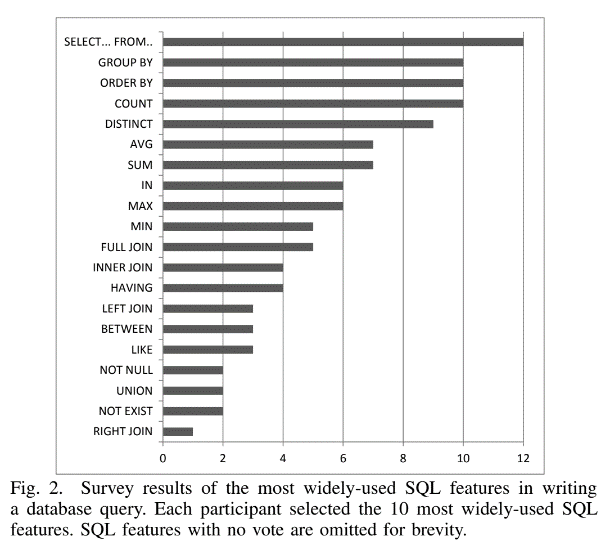
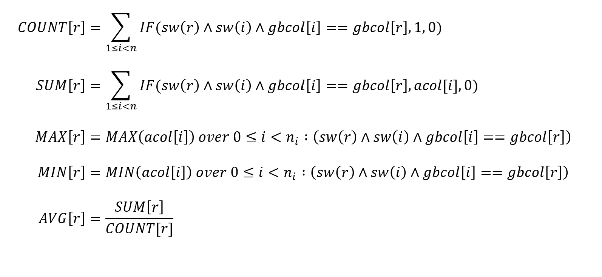
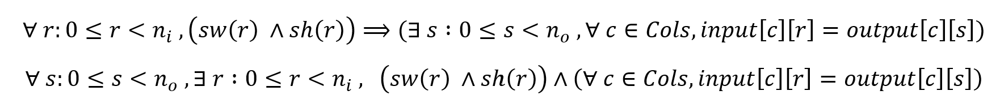
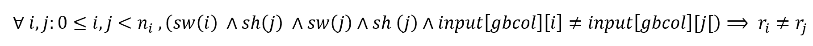

Abstract 
========

SQL is a programming language used for accessing and updating relational
databases, but is hard to pick up as a beginner or as someone with no
background in programming. For our project, we wanted to build on what
we learned about Program Synthesis, SMT solvers and our knowledge of SQL
to create a tool that can generate SQL queries given input/output
examples. Our approach takes an input and output table, and generates a
set of constraints that encodes the semantics of a SQL query that would
produce the output table given the input table. It then passes the
constraints in to Z3, an SMT solver, to check if they are satisfiable.
If they are, we use the Z3 output to generate the corresponding SQL
query. Our implementation works well on small datasets and generates
correct queries. In this paper we describe the approach we took, explain
the constraints we encoded based on I/O, and display some of the
results.

Introduction
============

Program synthesis is the task of automatically finding a program in the
underlying programming language that satisfies the user intent expressed
in the form of some specification. The principles of Program Synthesis
can be applied to a variety of different problems such as program
repair, super-optimization, and code generation. For our project we
decided to explore the synthesis of SQL queries given input and output
tables. Our approach involves the creation of constraints based on the
input/output example provided and using an SMT solver (Z3) to generate a
SQL query that would produce the given output. Our project is based off
the paper “*SqlSol: An accurate SQL Query Synthesizer”* by Lin Cheng
^\[2\]^. We had to adapt our implementation and made changes to some of
the constraints, but all the credit for the approach goes to them. In
this report we will present and explain constraints from the original
paper, any modifications we made, and describe our specific encoding and
implementation of the technique. Our code can be found under
[SQLSynthesis](https://github.com/vidhartbhatia/SQLSynthesis) on
GitHub^\[1\]^

An Overview of SQL
------------------

SQL is Structured Query Language, which is a computer language for
storing, manipulating, and retrieving data stored in a relational
database. Our synthesizer can generate queries containing the following
SQL clauses:

-   SELECT: Extracts the specified columns, or aggregates over columns.
    We support SUM, COUNT, AVG, MIN and MAX aggregates.

-   WHERE: Extracts only those rows that fulfil a specified condition.

-   GROUP BY: Projects tuples into subsets and calculates aggregates
    over these subsets.

-   HAVING: Like the WHERE clause for but only for aggregate columns.

SMT solvers and Z3
------------------

Satisfiability modulo theories (SMT) solvers build upon traditional
Boolean Satisfiability (SAT) solvers by adding in support for predicates
that are analysed using theories other than propositional logic. They
support linear arithmetic, theory of arrays, uninterpreted functions,
and more theories and methods. Our project makes use of Z3, an SMT
solver developed by Microsoft.[^1] We decided to use Z3 because we were
already familiar with the API, it has good documentation, and it is easy
to use. Z3 allowed us the freedom to encode out input and output tables
using a custom datatype and make assertions based on them.

Determining a SQL Query Template
================================

We wanted to start with a subset or simplified version of SQL to make our task feasible and, as it turns
out, the other papers did research into what subset of SQL they needed
to support. A survey by Zhang et al ^\[3\]^ showed the most common types
of queries used in the Industry.

Going off this and Cheng’s reasoning in the SqlSol paper, we decided to
have all generated queries follow a template.

The template and unknowns are as follows:

**SELECT** *&lt;select\_col\_0&gt;, &lt;select\_col\_1&gt;, ...,
&lt;select\_col\_n&gt;* **FROM** input\_table

**WHERE** *&lt;where\_col&gt; &lt;where\_operator&gt;
&lt;where\_constant&gt;*

**GROUP BY** *&lt;group\_by\_col&gt;*

**HAVING** *&lt;having\_col&gt; &lt;having\_operator&gt;
&lt;having\_constant&gt;*

Where *n* is the number of columns in the output table. The template can
be extended to include multiple WHERE and HAVING conditions, but we
chose to limit the number of conditions to one each in the interest of
simplicity and performance.

Implementation
==============

Overview
--------

Our approach is a simplified version of the algorithm described in
SqlSol^\[2\]^. It is described below:

1.  Given an Input table I and output table O, encode them in Z3 data
    structures.

2.  Generate aggregate and group by columns and add them to I

3.  Generate domain constraints for template unknowns

4.  Generate input/output constraints

Finally, we send the constraints above to an SMT solver(Z3) to check for
satisfiability. If they are satisfiable, we get the model from the
solver and substitute the unknowns in the templated query to generate
our final SQL query.

Z3 Table representation
-----------------------

Since tables can contain values of various types (strings, ints, reals,
etc.), we needed our table cells to be polymorphic. However, Z3 does not
inherently support polymorphism. To circumvent this, we created our own
Cell datatype with type, int, real and string accessors. The “type”
accessor is of string sort, and can have values “int”, “real” or
“string”. The other accessors are of their respective sorts, but only
contain a meaningful value if the “type” accessor contains the string
corresponding to that type. Our datatype can be extended to support more
types.

Our input and output tables are represented as double-dimensional
arrays. The outer array maps strings (column names) to ints (row
numbers), and the inner array maps ints (row numbers) to our Cell
datatype.

Unknowns and Domain constraints
-------------------------------

The constraints placed on the unknowns in our template are as follows:

-   **select\_col\_i** $\mathbf{\in}$ **input columns ∪ aggregate
    columns.**\
    The set of aggregate columns is defined in section 4.4 below.

-   **where\_col** $\mathbf{\in}$ **input columns**

-   **having\_col** $\mathbf{\in}$ **aggregate columns** $\mathbf{\cap}$
    **select columns.**\
    The column in the HAVING clause must be an aggregate, and must be a
    column in the SELECT clause.

-   **where\_operator, having\_operator ∈ { =, !=, &lt;, &gt;, &lt;=
    , &gt;= }**

-   **where\_constant ∈ input\_table\[where\_col\].**\
    We constrain the constant being compared to in the WHERE condition
    to be value from the where\_col.

-   **having\_constant ∈ input\_table\[having\_col\]**

-   **group\_by\_col ∈ input columns ∪ {equal column, unique column}.**\
    The equal and unique columns are two special columns we added; the
    equal column contains the same value in each row, while the unique
    column contains a unique value in each row. Grouping by the equal
    column means the whole table is one group. This is useful for taking
    aggregates over entire columns. Grouping by the unique column means
    that each row is its own group. This allows us to generalize to
    queries without GROUP BY clauses. We only include a GROUP BY clause
    in our output if the group\_by\_col is an input column.

Additionally, we add the constraint that if the group\_by\_col is not
the equal column or the unique column, then any non-aggregate columns in
the SELECT clause must be the group\_by\_col. If this were not the case,
then the query generated would be invalid.

Generating Aggregate Columns
----------------------------

To support aggregate columns, we create each possible aggregate column
using constraints and insert them into our input table before running
the solver. The generated columns contain values based on what is
assigned to the various unknowns, such as the group by column and the
where predicate. This allows Z3 to search over all the possible
aggregate columns and then choose one to select from if needed. We
supported the following aggregation functions: **MAX, MIN, COUNT, SUM,
AVG**, and detailed explanation on how we assigned them follows. For
each of the below formulae, $r$ represents the current row, $n$ is the
number of rows in the input table, $\text{IF}$ represents an
if-then-else constraint, $i$ represents a row index, $\text{sw}$ and
$\text{sh}$ represent the satisfies where and satisfies having predicate
constraints (defined in the next section), $\text{gbcol}$ represents the
group by column unknown, and $\text{acol}$ represents the aggregate
column chosen.

Where and Having Constraints
----------------------------

We introduce variables $\text{sw}$ (satisfies WHERE) and $\text{sh}$
(satisfies HAVING) that determine whether a row $r$ is included in the
output table.

*sw = &lt;where\_clause\_missing&gt;* ∨
($input\_ table\lbrack$&lt;where\_col&gt;\]$\lbrack r\rbrack$
*&lt;where\_operator&gt; &lt;where\_constant&gt;*$)$

*hw = &lt;having\_clause\_missing&gt;* ∨
$\ (input\_ table\lbrack$&lt;having\_col&gt;$\rbrack\lbrack r\rbrack$
*&lt;having\_operator&gt; &lt;having\_constant&gt;*$)$

*where\_clause\_missing* and *having\_clause\_missing* are booleans that
allow Z3 to omit the WHERE and HAVING clause, respectively. If a WHERE
clause in necessary, the constraint
input\_table\[*&lt;where\_col&gt;*\]\[r\] *&lt;where\_operator&gt;
&lt;where\_constant &gt;* ensures that only rows for which the condition
is met are included in the output table (likewise for HAVING). The way
we use $\text{sw}$ and $\text{sh}$ to include and exclude rows is shown
in the next section.

Input-Output constraints
------------------------

This set of constraints encode the semantics of a SQL query given the
input and output tables.

Essentially, for each row $r$ in the input table, the query first checks
the predicates in the WHERE and HAVING clause. If they are both true,
the columns of the row in the SELECT clause will form a row in the
output table, which we call $s$. Otherwise the row will be skipped, as
is allowed by encoding it in an Implication statement. In the reverse
direction, for a row $s$ in the output, there must exist a row in the
input that satisfies the predicates in the WHERE and HAVING clause. We
also constraint the range of $r$ and $s$ using the number of rows in the
input and output, respectively. We are essentially enforcing a mapping
between rows of the input and output tables, encoding the WHERE and
HAVING predicates into the constraints.

Uniqueness Constraints
----------------------

We realised that to generate correct SQL queries we had to enforce
certain uniqueness constraints on the input/output row mappings. Since
our constraints rely on mapping each input row (that satisfies where and
having predicates) to an output row, we must allow multiple input rows
to map to a single output row. To only allow this in valid cases we must
ensure that only rows belonging to the same group by group can map to
the same output row. We ensure this by adding constraints such as:

Where $r_{i}$ represents the output row that input row $\text{i\ }$maps
to. This also generalizes in the case where we don’t have a group by
clause, as represented when the group by column unknown is set to the
unique\_rows column, as in this case it will enforce that every input
row must map to a unique output row. For the reverse mapping, we simply
ensure that each output row maps to a unique input row, as no SQL query
in our scope can generate more output rows than input rows, and
enforcing the unique mapping ensures correct results.

Joins and Other Operations
--------------------------

As described in the other papers, implementing JOIN into the query
synthesis process is straight forward and can be done as a
pre-processing step in our algorithm, so we decided to leave it out for
now. As for DISTINCT and ORDER BY, since the nature of our method relies
on encoding constraints and using Z3, it is hard to build constraints
that enforce an ordering as the underlying implementation makes use of
sets. However, it is shown that DISTINCT and ORDER BY can be supported
in post processing on the generated model by comparing the result table
with the output table.

Testing and Results
===================

Test 1: Input Table Test 2: Output Table Test 1: Generated Query

  **Name**   **Age**   **Score**
  ---------- --------- -----------
  Vidhart    22        12.5
  Udit       22        50.0
  Ebru       19        9.9
  Jeremy     21        100.0
  Medha      22        50.0

  **NAMES**   **AGES**
  ----------- ----------
  Vidhart     22
  Udit        22
  Ebru        19
  Jeremy      21
  Medha       22

Test 2: Input Table Test 2: Output Table Test 2: Generated Query

  **Name**   **Age**   **Score**
  ---------- --------- -----------
  Vidhart    22        12.5
  Udit       22        50.0
  Ebru       19        9.9
  Jeremy     21        100.0
  Medha      22        50.0

  **Passing**   **Score**
  ------------- -----------
  Udit          50.0
  Jeremy        100.0
  Medha         50.0

Test 3: Input Table Test 3: Output Table Test 3: Generated Query

  **Name**   **Age**   **Score**
  ---------- --------- -----------
  Vidhart    22        12.5
  Udit       22        50.0
  Ebru       19        9.9
  Jeremy     21        100.0
  Medha      22        50.0

  **Avg Score**
  ---------------
  44.48

Test 4: Input Table Test 4: Output Table Test 4: Generated Query

  **Name**   **Age**   **Score**
  ---------- --------- -----------
  Vidhart    22        12.5
  Udit       22        50.0
  Ebru       19        9.9
  Jeremy     21        100.0
  Medha      22        50.0

  **Age**   **Count**
  --------- -----------
  22        3
  21        1
  19        1

Correct query: SELECT Age AS Age, COUNT(Age) AS Count FROM input\_table
GROUP BY Age\
As we can see, the query generated was not wrong, but made us of a MIN
that wasn’t necessary. Since a system of constraints can have multiple
satisfying assignments, and we can’t control which one Z3 will pick,
some of our results have added clauses or aggregates that don’t make the
query incorrect, but aren’t necessary.

Test 5: Input Table Test 5: Output Table Test 5: Generated Query

  **Name**   **Age**   **Score**
  ---------- --------- -----------
  Vidhart    22        12.5
  Udit       22        50.0
  Ebru       19        9.9
  Jeremy     21        100.0
  Medha      22        50.0

  **Age**   **Max Score**
  --------- ---------------
  22        50
  21        100

Alternate Query generated: "SELECT Age AS Age, MAX(Score) AS Max Score
FROM input\_table WHERE Score &gt;= 25/2 GROUP BY Age"

Test 6: Input Table Test 6: Output Table Test 6: Generated Query

  **Name**   **Age**   **Score**
  ---------- --------- -----------
  Vidhart    19        75.0
  Udit       20        50
  Ebru       21        9.9
  Jeremy     21        100.0
  Medha      22        12.5

  **Age**   **Sum**
  --------- ---------
  19        75.0
  21        109.9

Alternate query generated: "SELECT Age AS Age, SUM(Score) AS Sum of
Scores FROM input\_table WHERE Name &gt;= "Ebru" GROUP BY Age HAVING
SUM(Score) &gt;= 75"\
This query is not wrong, but includes an unnecessary WHERE clause.

This is just a subset of the tests we ran, but overall, our
implementation was able to synthesize all the queries correctly.

It is evident that queries using aggregates and HAVING predicates run
extremely slow as compared to basic queries. Our tests also made use of
small input tables (\~5 rows. As the size of the input table grows, the
queries take to generate, but we have not determined what the factor is.

Optimisations
=============

-   Since our implementation is much slower when we generate aggregate
    columns and include GROUP BY and HAVING constraints, we decided to
    have our algorithm first attempt to generate a query without GROUP
    BY or HAVING clauses, then only without a HAVING clause, and then
    finally with all the clauses. This obviously slows down the
    generation of queries that need HAVING, but for simpler queries it
    speeds up generation significantly.

-   Short circuiting in our Cell datatype comparison and arithmetic
    functions.

-   Using implications to simplify certain constraints.

Conclusion
==========

We were able to achieve our goal of synthesizing SQL queries given input
and output examples and learned a lot along the way. Given that our
implementation ran extremely slow for large tables or complicated
queries we conclude that this approach doesn’t scale well and will need
to be heavily optimised to be useful in industry. An approach could
include taking a small random sample of the output table to feed into
our algorithm, and then adding more rows only if the resulting query is
not satisfactory.

Understanding the semantics of encoding the input and output table to
match SQL queries was also a learning experience and something that can
be applied in other use cases in the future.

We also think that this approach could be used to generate alternate SQL
queries for a given query, as the SMT solver searched through the entire
solution space. While testing we saw alternative queries generated to
what was expected, so a hybrid approach could be made where the user can
input a SQL query and the synthesizer can create an alternate query that
generates the same result. This approach could give users additional
insights, and could additionally be supplemented to find queries based
on parameters such as efficiency or length.

References
==========

\[1\] <https://github.com/vidhartbhatia/SQLSynthesis>

\[2\] Cheng L. (2019) SqlSol: An accurate SQL Query Synthesizer. In:
Ait-Ameur Y., Qin S. (eds) Formal Methods and Software Engineering.
ICFEM 2019. Lecture Notes in Computer Science, vol 11852. Springer, Cham

URL: <https://link.springer.com/chapter/10.1007%2F978-3-030-32409-4_7>

\[3\] S. Zhang and Y. Sun, "Automatically synthesizing SQL queries from
input-output examples," *2013 28th IEEE/ACM International Conference on
Automated Software Engineering (ASE)*, Silicon Valley, CA, 2013, pp.
224-234. doi: 10.1109/ASE.2013.6693082\
URL: <http://ieeexplore.ieee.org.proxy.library.cmu.edu/stamp/stamp.jsp?tp=&arnumber=6693082&isnumber=6693054>

\[4\] Scythe: <https://scythe.cs.washington.edu/> source:
<https://github.com/Mestway/Scythe>

[^1]: <https://github.com/Z3Prover/z3>
